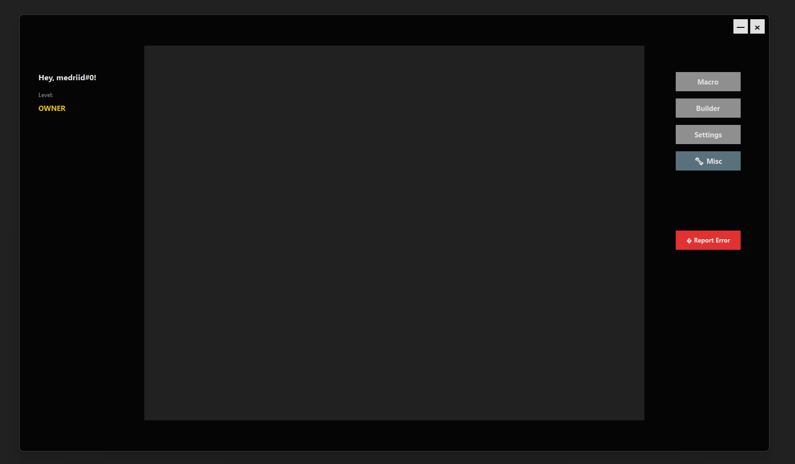
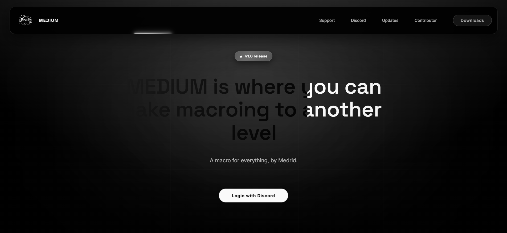

# MEDIUM - Advanced Macro Automation Tool

MEDIUM is a powerful AutoHotkey-based macro automation application designed for precise workflow automation with a modern, transparent overlay interface. Built for Windows users who need reliable, repeatable task automation with advanced features like Discord authentication, workflow building, and comprehensive performance monitoring.



## Overview

MEDIUM provides a sophisticated macro recording and playback system with a transparent overlay that frames your active window. The application captures mouse movements, clicks, and keyboard inputs with high precision, allowing you to automate repetitive tasks across any Windows application.

### Key Features

**Macro Recording & Playback**
- High-precision recording at 60fps for smooth mouse tracking
- Captures mouse movements, clicks (left, right, middle), and keyboard inputs
- Client-relative coordinate system ensures consistent playback across window positions
- Accurate mouse positioning mode (teleport) or smooth natural movement
- Save recordings as .medium files with custom names
- Playback recorded macros with F10 hotkey

**Workflow Builder**
- Chain multiple macros into complex automation workflows
- Configure repeat counts for each workflow block
- Add delays between workflow steps (0.1s to 10s)
- Execute entire workflows with single button press
- Rename, reorder, and remove workflow blocks dynamically
- Real-time workflow validation before execution

**Window Management**
- Transparent overlay with customizable opacity (0-255)
- Fit any active window to the overlay void area (Ctrl+Alt+G)
- Draggable frame interface that doesn't interfere with target applications
- See-through center void area with precise dimensions (1040x780)
- Minimize to tray functionality with quick restore

**Authentication System**
- Discord OAuth2 integration for secure user authentication
- JWT token-based session management (30-day expiration)
- Role-based access control via Discord server roles
- Machine binding for multi-device license management
- Seamless login with token persistence

**Advanced Tools**
- Quick Actions panel for rapid workflow execution (Ctrl+Alt+Q)
- Execution History tracking with success/failure logging
- Performance Monitor for system resource usage
- Hotkey Manager for custom keyboard shortcuts
- Relative Coordinates selector for precise point selection
- Color Picker with custom UI for theme customization
- Error Reporter for submitting bug reports with automatic diagnostics

**Customization**
- Full theme customization (frame color, buttons, text, hover states)
- Adjustable transparency and opacity
- Custom button colors and hover effects
- Configurable control button appearance
- Persistent settings via INI file

## System Requirements

- Windows 10 or Windows 11
- AutoHotkey v2.0 or later
- 4GB RAM minimum (8GB recommended)
- 100MB free disk space
- Active internet connection for authentication
- Discord account for login

## Installation

1. Download the latest release from the repository
2. Extract all files to a directory of your choice
3. Ensure the following folder structure exists:
   ```
   macro/
   ├── main.ahk
   ├── ImagePut.ahk
   ├── components/
   ├── assets/
   │   ├── icons/
   │   └── maps/
   └── data/
   ```
4. Run `main.ahk` with AutoHotkey v2.0

## Quick Start Guide

### First Launch

1. Launch the application - a loading screen will appear
2. Authenticate with your Discord account when prompted
3. The main overlay will appear centered on your screen

### Recording Your First Macro

1. Press **Ctrl+Alt+G** while focused on the target application window
2. The window will automatically resize to fit the overlay void area
3. Press **F9** to start recording
4. Perform the actions you want to automate
5. Press **F9** again to stop recording
6. Enter a name for your macro when prompted
7. The macro is saved as a .medium file in `data/records/`

### Playing Back Macros

1. Press **F10** to replay the most recently recorded macro
2. Or open the Macro panel from the overlay sidebar
3. Select a saved macro from the list
4. Configure loop count and delay if needed
5. Click "Play" or use the hotkey

### Building Workflows

1. Click the "Builder" button in the overlay sidebar
2. Double-click macros from the left panel to add them to your workflow
3. Configure repeat counts for each block
4. Add delays between blocks as needed
5. Save the workflow with a custom name
6. Execute the entire workflow with one click

## Features in Detail

### Macro Recording System

The recorder captures actions at high frequency for precise reproduction:

- **Mouse Tracking**: 60fps position sampling with 3-pixel noise threshold
- **Click Detection**: Captures left, right, and middle button presses with exact timing
- **Keyboard Input**: Records all keypresses with key-down and key-up events
- **Scroll Events**: Records mouse wheel scrolling with delta values
- **Timing Precision**: Millisecond-accurate delays between actions
- **Coordinate Modes**: Client-relative coordinates for window-independent playback

### Workflow Builder

Create complex automation sequences:

- **Block-Based Design**: Each macro becomes a reusable workflow block
- **Repeat Configuration**: Set individual repeat counts for each block (1-100)
- **Delay Insertion**: Add timed pauses between workflow steps
- **Execution Control**: Pause, resume, or stop workflows mid-execution
- **Workflow Management**: Save, load, rename, and delete complete workflows
- **Visual Feedback**: Real-time progress indicators during execution

### Window Fitting

Smart window management for consistent automation:

- **Auto-Resize**: Fitted windows automatically resize to overlay void dimensions
- **Position Locking**: Windows maintain fitted state until manually closed
- **Multi-Window Support**: Switch between different fitted windows
- **Restoration**: Windows restore original size when unfitted
- **Validation**: Prevents recording without a fitted window

### Authentication

Secure multi-user access control:

- **Discord OAuth2**: Industry-standard authentication flow
- **Role Verification**: Server-side role checking via Discord API
- **Token Management**: Encrypted local storage with machine-specific keys
- **Session Validation**: Automatic token refresh and expiration handling
- **Multi-Device**: Bind/unbind machines from your account
- **Access Levels**: Support for OWNER, PREMIUM, and custom tiers

### Performance Monitoring

Real-time system metrics:

- **CPU Usage**: Track processor utilization per core
- **RAM Usage**: Monitor memory consumption
- **Disk Activity**: Read/write operations tracking
- **Network Stats**: Upload/download bandwidth monitoring
- **Execution Time**: Measure macro playback duration
- **Success Rate**: Calculate automation reliability percentage

### Execution History

Comprehensive activity logging:

- **Timestamped Records**: Every macro execution logged with precise timestamps
- **Success/Failure Tracking**: Automatic error detection and logging
- **Execution Duration**: Track how long each macro takes
- **Filter Options**: View recent, failed, or all executions
- **Export Capability**: Export history to CSV or JSON
- **Storage Management**: Auto-cleanup of old history entries

## Configuration

### Settings Panel

Access via the Settings button in the overlay sidebar:

**Appearance**
- Frame Color: Customize the overlay frame color (hex color picker)
- Opacity: Adjust transparency (0-255 scale)
- Button Background: Set default button background color
- Button Text: Configure button text color
- Button Hover BG: Hover state background color
- Button Hover Text: Hover state text color
- Control Buttons BG: Window control button colors

**Playback Settings**
- Accurate Mouse Mode: Toggle between smooth tweening and instant positioning
  - OFF: Natural smooth mouse movement
  - ON: Instant teleport to exact coordinates for precision clicking

**Keybinds**
- Ctrl+Alt+G: Fit active window to overlay
- Ctrl+Alt+M: Show/hide overlay
- Ctrl+Alt+Q: Quick actions panel
- F9: Start/stop macro recording
- F10: Replay last recording

**Account**
- View logged-in username and access level
- Logout and unbind machine from account

### Settings File

Settings are stored in `data/settings.ini`:

```ini
[Colors]
FrameColor=000000
ButtonBackground=808080
ButtonTextColor=FFFFFF
ButtonHoverBG=A0A0A0
ButtonHoverText=00D4FF
ControlButtonBG=333333
ControlButtonHover=555555

[Appearance]
Opacity=220

[Playback]
AccurateMouseMode=0
```

## File Structure

```
macro/
├── main.ahk                      # Main application entry point
├── ImagePut.ahk                  # Image rendering library
├── medium.exe                    # Compiled executable (if available)
│
├── components/                   # Modular component system
│   ├── Authentication.ahk        # Discord OAuth2 integration
│   ├── ColorPicker.ahk           # Custom color selection UI
│   ├── Config.ahk                # Global configuration constants
│   ├── ErrorReporter.ahk         # Bug reporting system
│   ├── ExecutionHistory.ahk      # Execution logging
│   ├── HotkeyManager.ahk         # Custom hotkey bindings
│   ├── MacroGUI.ahk              # Macro selection interface
│   ├── MacroPlayer.ahk           # Playback engine
│   ├── MacroRecorder.ahk         # Recording engine
│   ├── MiscMenu.ahk              # Miscellaneous tools menu
│   ├── Notifications.ahk         # Toast notification system
│   ├── PerformanceMonitor.ahk    # System metrics tracking
│   ├── QuickActions.ahk          # Rapid workflow launcher
│   ├── RelativeCoordinates.ahk   # Coordinate selection tool
│   ├── SeamlessLogin.ahk         # Authentication UI
│   ├── UsageMetrics.ahk          # Analytics tracking
│   ├── WindowManager.ahk         # Window fitting system
│   ├── WorkflowBuilder.ahk       # Workflow creation interface
│   └── webview/                  # WebView2 components
│
├── assets/                       # Application resources
│   ├── icons/                    # Application icons
│   │   ├── mdium.ico             # Tray icon
│   │   └── mdium.png             # Application logo
│   └── maps/                     # Map icons (if applicable)
│
└── data/                         # User data storage
    ├── records/                  # Saved macro recordings (.medium files)
    ├── workflows/                # Saved workflow configurations
    ├── history/                  # Execution history logs
    ├── settings.ini              # Application settings
    └── auth_token.dat            # Encrypted authentication token
```

## Macro File Format

Macros are saved as `.medium` files in JSON format:

```json
{
  "name": "Example Macro",
  "version": "2.0",
  "recorded": "2025-11-15T10:30:00",
  "actions": [
    {
      "type": "mouse_move",
      "x": 150,
      "y": 200,
      "delay": 50
    },
    {
      "type": "mouse_click",
      "button": "left",
      "x": 150,
      "y": 200,
      "delay": 100
    },
    {
      "type": "key_press",
      "key": "a",
      "delay": 50
    }
  ]
}
```

## Coordinate System

MEDIUM uses a client-relative coordinate system for reliable cross-session playback:

**Recording Phase:**
1. Mouse position captured in screen coordinates
2. Converted to client-relative coordinates of fitted window
3. Stored with relative X,Y values

**Playback Phase:**
1. Client-relative coordinates retrieved from macro file
2. Converted to current screen coordinates of fitted window
3. Mouse moved to calculated screen position
4. Actions executed at precise locations

This system ensures macros work correctly even if:
- The window moves on screen
- The window is minimized and restored
- The application restarts between recording and playback

## Troubleshooting

**Application won't start**
- Verify AutoHotkey v2.0 is installed
- Check that all component files exist in the `components/` folder
- Review `ImagePut.ahk` is present in the root directory

**Authentication fails**
- Ensure internet connection is active
- Verify Discord account has required server role
- Check firewall isn't blocking the application
- Try deleting `data/auth_token.dat` and logging in again

**Macros don't play back correctly**
- Ensure a window is fitted before playback (Ctrl+Alt+G)
- Verify the target application is in the same state as during recording
- Try enabling "Accurate Mouse Mode" in Settings
- Check that the fitted window hasn't moved or resized

**Recording captures wrong coordinates**
- Always fit the target window before recording
- Ensure clicks are within the fitted window boundary
- Verify coordinate mode is set to client-relative

**Overlay not visible**
- Check opacity setting isn't set to 0
- Verify the overlay isn't minimized to tray
- Press Ctrl+Alt+M to restore visibility
- Restart the application if the window is stuck off-screen

**High CPU usage during recording**
- Recording at 60fps is CPU-intensive by design
- This is normal during active recording
- CPU usage returns to idle after stopping recording
- Consider closing other applications during recording

## Support & Website



For additional support, feature requests, and community discussion, visit the MEDIUM support website. The website provides:

- Comprehensive documentation and tutorials
- Video guides for common workflows
- Community forums for user discussions
- Direct support ticket submission
- Feature request voting system
- Release notes and changelog

Access is granted automatically upon successful authentication through the application.

## Privacy & Data

**Local Data Storage:**
- Recorded macros are stored locally in `data/records/`
- Settings and preferences saved in `data/settings.ini`
- Authentication token encrypted and stored in `data/auth_token.dat`
- Execution history kept in `data/history/`

**Network Communication:**
- Authentication requests to Discord OAuth2 API
- Token validation with authentication server
- Error reports sent to support server (opt-in)
- Usage metrics for license verification (minimal)

**Data Collection:**
- No macro content is uploaded to servers
- No keylogging or screen capture beyond local recording
- No personal data collected beyond Discord username/ID
- Authentication tokens are machine-specific and encrypted

## License & Distribution

MEDIUM is proprietary software with access controlled via Discord server roles. Distribution, modification, or reverse engineering of the application is prohibited without explicit permission.

**Licensing:**
- Access granted through Discord server membership
- Multiple access tiers available (OWNER, PREMIUM, etc.)
- Machine binding limits enforced server-side
- Commercial use requires appropriate license tier

## Credits

**Technologies:**
- AutoHotkey v2.0 - Application framework
- ImagePut Library - Image rendering
- Discord OAuth2 - Authentication system
- WebView2 - Embedded browser components

**Development:**
- Interface design and implementation
- Macro recording engine with high-precision capture
- Workflow automation system
- Authentication integration
- Component-based architecture

## Version

Current Version: 2.0

This README reflects the latest stable release of MEDIUM Macro Automation Tool.

---

For technical support, bug reports, or feature requests, use the Error Reporter built into the application or contact support through the official website.
